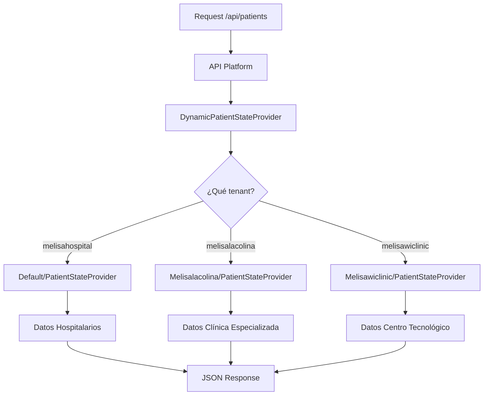

# 🚀 API Platform Multi-Tenant con State Providers Dinámicos

## 📋 Tabla de Contenidos

1. [Introducción](#introducción)
2. [Arquitectura del Sistema](#arquitectura-del-sistema)
3. [Estructura de Archivos](#estructura-de-archivos)
4. [Configuración](#configuración)
5. [State Providers por Tenant](#state-providers-por-tenant)
6. [Ejemplos de Uso](#ejemplos-de-uso)
7. [API Endpoints](#api-endpoints)
8. [Desarrollo y Extensibilidad](#desarrollo-y-extensibilidad)

---

## 🎯 Introducción

Este proyecto implementa **API Platform 4.2** con un sistema **multi-tenant** usando **State Providers dinámicos**. La arquitectura permite que cada tenant (subdominio) tenga su propia lógica de datos y endpoints API personalizados, sin duplicar entidades Doctrine.

### 🔑 Características Principales

- ✅ **Multi-tenancy** por subdominios
- ✅ **State Providers dinámicos** que cargan según el tenant
- ✅ **API Resources genéricos** reutilizables
- ✅ **Datos personalizados** por cada establecimiento médico
- ✅ **Sin duplicación de entidades** Doctrine
- ✅ **Integración completa** con Symfony 6.4

---

## 🏗️ Arquitectura del Sistema

### 📊 Diagrama de Flujo



### 🔧 Componentes Principales

1. **ApiResource** - Definición genérica del recurso Patient
2. **DynamicPatientStateProvider** - Router que delega según tenant
3. **State Providers específicos** - Lógica de datos por tenant
4. **TenantContext** - Servicio para detectar tenant actual

---

## 📂 Estructura de Archivos

```
src/
├── ApiResource/
│   └── Patient.php                      # ← Recurso API genérico
├── State/
│   ├── DynamicPatientStateProvider.php # ← Provider principal (router)
│   ├── Default/
│   │   └── PatientStateProvider.php    # ← melisahospital (default)
│   ├── Melisalacolina/
│   │   └── PatientStateProvider.php    # ← melisalacolina
│   └── Melisawiclinic/
│       └── PatientStateProvider.php    # ← melisawiclinic
├── Service/
│   ├── TenantContext.php               # ← Contexto de tenant
│   └── TenantResolver.php              # ← Resolución de tenant
config/packages/
├── api_platform.yaml                   # ← Configuración API Platform
└── services.yaml                       # ← Servicios Symfony
```

---

## ⚙️ Configuración

### 📄 config/packages/api_platform.yaml

```yaml
api_platform:
    title: 'Melisa Medical API - Sistema Multi-tenant'
    description: 'API REST para gestión médica hospitalaria y clínicas'
    version: 1.0.0
    
    defaults:
        stateless: true
        cache_headers:
            vary: ['Content-Type', 'Authorization', 'Origin', 'X-Tenant-Context']
    
    swagger:
        versions: [3]
    
    formats:
        jsonld: ['application/ld+json']
        json: ['application/json']
        html: ['text/html']
        xml: ['application/xml', 'text/xml']
        csv: ['text/csv']
    
    collection:
        pagination:
            enabled: true
            page_parameter_name: page
            enabled_parameter_name: pagination
            items_per_page_parameter_name: itemsPerPage
```

### 🔧 config/services.yaml

```yaml
services:
    # API Platform State Providers
    App\State\DynamicPatientStateProvider:
        autowire: true
        tags: ['api_platform.state_provider']
    
    App\State\Default\PatientStateProvider:
        autowire: true
        
    App\State\Melisalacolina\PatientStateProvider:
        autowire: true
        
    App\State\Melisawiclinic\PatientStateProvider:
        autowire: true
```

---

## 🏥 State Providers por Tenant

### 1. 🔄 DynamicPatientStateProvider (Router Principal)

**Ubicación:** `src/State/DynamicPatientStateProvider.php`

```php
<?php
namespace App\State;

use ApiPlatform\Metadata\Operation;
use ApiPlatform\State\ProviderInterface;

class DynamicPatientStateProvider implements ProviderInterface
{
    public function provide(Operation $operation, array $uriVariables = [], array $context = []): object|array|null
    {
        $request = $this->requestStack->getCurrentRequest();
        $tenant = $request?->headers->get('X-Tenant-Context') ?? 'melisahospital';
        
        $providerClass = $this->getProviderClassForTenant($tenant);
        
        if (class_exists($providerClass)) {
            $provider = new $providerClass($this->tenantContext, $this->requestStack);
            return $provider->provide($operation, $uriVariables, $context);
        }
        
        // Fallback al provider por defecto
        $defaultProvider = new \App\State\Default\PatientStateProvider($this->tenantContext, $this->requestStack);
        return $defaultProvider->provide($operation, $uriVariables, $context);
    }

    private function getProviderClassForTenant(string $tenant): string
    {
        $tenantClassMap = [
            'melisahospital' => 'App\\State\\Default\\PatientStateProvider',
            'melisalacolina' => 'App\\State\\Melisalacolina\\PatientStateProvider',
            'melisawiclinic' => 'App\\State\\Melisawiclinic\\PatientStateProvider',
        ];

        return $tenantClassMap[$tenant] ?? 'App\\State\\Default\\PatientStateProvider';
    }
}
```

### 2. 🏥 Hospital Provider (Default)

**Ubicación:** `src/State/Default/PatientStateProvider.php`

**Datos especializados para:**
- Pacientes hospitalizados
- UCI y cirugía
- Oncología
- Tratamientos complejos

**Ejemplo de datos:**
```json
{
  "id": "HSP001",
  "name": "Dr. María González - Paciente Hospitalario",
  "email": "maria.gonzalez@melisahospital.cl",
  "address": "Av. Hospital 123, Santiago",
  "bloodType": "O+",
  "allergies": ["Penicilina", "Mariscos"],
  "medications": ["Metformina 500mg", "Losartán 50mg", "Aspirina 100mg"]
}
```

### 3. 🏥 Clínica La Colina Provider

**Ubicación:** `src/State/Melisalacolina/PatientStateProvider.php`

**Datos especializados para:**
- Cardiología especializada
- Neurología
- Ginecología
- Dermatología
- Traumatología

**Ejemplo de datos:**
```json
{
  "id": "COL001",
  "name": "Esperanza Morales - Paciente Cardiología",
  "email": "esperanza.morales@lacolina.cl",
  "address": "Av. La Colina 100, Las Condes",
  "bloodType": "O-",
  "allergies": ["Betabloqueadores"],
  "medications": ["Atorvastatina 40mg", "Metoprolol 50mg"]
}
```

### 4. 💻 Wi Clinic Provider (Centro Tecnológico)

**Ubicación:** `src/State/Melisawiclinic/PatientStateProvider.php`

**Datos especializados para:**
- Telemedicina
- Wearables y sensores IoT
- Inteligencia Artificial diagnóstica
- Realidad Virtual terapéutica
- Blockchain para historiales

**Ejemplo de datos:**
```json
{
  "id": "WIC001",
  "name": "Alejandro Tech - Paciente Telemedicina",
  "email": "alejandro.tech@wiclinic.cl",
  "address": "Av. Tecnología 1000, Providencia",
  "allergies": [],
  "medications": ["Multivitamínico"],
  "tenant": "melisawiclinic"
}
```

---

## 🌐 API Endpoints

### 📋 Endpoints Disponibles

| Método | Endpoint | Descripción |
|--------|----------|-------------|
| `GET` | `/api/patients` | Lista todos los pacientes del tenant |
| `GET` | `/api/patients/{id}` | Obtiene un paciente específico |

### 🎯 Ejemplos de Requests

#### 1. Lista de Pacientes - Hospital Melisa

```bash
curl -H "Accept: application/json" \
     -H "X-Tenant-Context: melisahospital" \
     "http://melisahospital.localhost:8081/api/patients"
```

**Respuesta:**
```json
[
  {
    "id": "HSP001",
    "name": "Dr. María González - Paciente Hospitalario",
    "cedula": "12345678-9",
    "email": "maria.gonzalez@melisahospital.cl",
    "bloodType": "O+",
    "allergies": ["Penicilina", "Mariscos"],
    "tenant": "melisahospital"
  }
]
```

#### 2. Lista de Pacientes - Clínica La Colina

```bash
curl -H "Accept: application/json" \
     -H "X-Tenant-Context: melisalacolina" \
     "http://melisalacolina.localhost:8081/api/patients"
```

**Respuesta:**
```json
[
  {
    "id": "COL001",
    "name": "Esperanza Morales - Paciente Cardiología",
    "cedula": "87654321-0",
    "email": "esperanza.morales@lacolina.cl",
    "bloodType": "O-",
    "allergies": ["Betabloqueadores"],
    "tenant": "melisalacolina"
  }
]
```

#### 3. Lista de Pacientes - Wi Clinic

```bash
curl -H "Accept: application/json" \
     -H "X-Tenant-Context: melisawiclinic" \
     "http://melisawiclinic.localhost:8081/api/patients"
```

**Respuesta:**
```json
[
  {
    "id": "WIC001",
    "name": "Alejandro Tech - Paciente Telemedicina",
    "cedula": "11223344-5",
    "email": "alejandro.tech@wiclinic.cl",
    "allergies": [],
    "medications": ["Multivitamínico"],
    "tenant": "melisawiclinic"
  }
]
```

#### 4. Paciente Individual

```bash
curl -H "Accept: application/json" \
     -H "X-Tenant-Context: melisahospital" \
     "http://melisahospital.localhost:8081/api/patients/HSP001"
```

---

## 🔧 Desarrollo y Extensibilidad

### ➕ Agregar un Nuevo Tenant

Para agregar un nuevo tenant (ej: `melisaurgencias`):

1. **Crear carpeta:**
   ```bash
   mkdir src/State/Melisaurgencias
   ```

2. **Crear State Provider:**
   ```php
   <?php
   namespace App\State\Melisaurgencias;
   
   use ApiPlatform\Metadata\Operation;
   use ApiPlatform\State\ProviderInterface;
   
   class PatientStateProvider implements ProviderInterface
   {
       public function provide(Operation $operation, array $uriVariables = [], array $context = []): object|array|null
       {
           // Lógica específica para urgencias
           return $this->getUrgencyPatients();
       }
   }
   ```

3. **Actualizar DynamicPatientStateProvider:**
   ```php
   private function getProviderClassForTenant(string $tenant): string
   {
       $tenantClassMap = [
           'melisahospital' => 'App\\State\\Default\\PatientStateProvider',
           'melisalacolina' => 'App\\State\\Melisalacolina\\PatientStateProvider',
           'melisawiclinic' => 'App\\State\\Melisawiclinic\\PatientStateProvider',
           'melisaurgencias' => 'App\\State\\Melisaurgencias\\PatientStateProvider', // ← Nuevo
       ];
       return $tenantClassMap[$tenant] ?? 'App\\State\\Default\\PatientStateProvider';
   }
   ```

4. **Registrar servicio:**
   ```yaml
   # config/services.yaml
   App\State\Melisaurgencias\PatientStateProvider:
       autowire: true
   ```

### 🔄 Crear Nuevos Recursos API

Para agregar un nuevo recurso (ej: `Appointment`):

1. **Crear ApiResource:**
   ```php
   // src/ApiResource/Appointment.php
   #[ApiResource(
       provider: DynamicAppointmentStateProvider::class
   )]
   class Appointment { }
   ```

2. **Crear DynamicStateProvider:**
   ```php
   // src/State/DynamicAppointmentStateProvider.php
   class DynamicAppointmentStateProvider implements ProviderInterface { }
   ```

3. **Crear State Providers por tenant:**
   ```
   src/State/Default/AppointmentStateProvider.php
   src/State/Melisalacolina/AppointmentStateProvider.php
   src/State/Melisawiclinic/AppointmentStateProvider.php
   ```

### 🧪 Testing

**Comando para limpiar caché:**
```bash
php bin/console cache:clear
```

**Verificar rutas API:**
```bash
php bin/console debug:router | grep api
```

**Probar endpoint:**
```bash
curl -H "Accept: application/json" \
     -H "X-Tenant-Context: {tenant}" \
     "http://{tenant}.localhost:8081/api/patients"
```

---

## 📚 Documentación API

La documentación interactiva de Swagger está disponible en:

- **Hospital Melisa:** http://melisahospital.localhost:8081/api
- **Clínica La Colina:** http://melisalacolina.localhost:8081/api  
- **Wi Clinic:** http://melisawiclinic.localhost:8081/api

---

## 🎯 Próximos Pasos

1. **✅ Integración con Stimulus** - Conectar frontend JavaScript
2. **🔄 State Processors** - Para operaciones POST/PUT/DELETE
3. **🔍 Filtros y Búsqueda** - Implementar filtros personalizados
4. **🔐 Autenticación** - JWT tokens por tenant
5. **📊 Paginación avanzada** - Personalizada por tenant
6. **📈 Métricas** - Monitoreo de uso por tenant

---

*Documentación actualizada: Octubre 15, 2025*
*Versión API Platform: 4.2*
*Versión Symfony: 6.4*