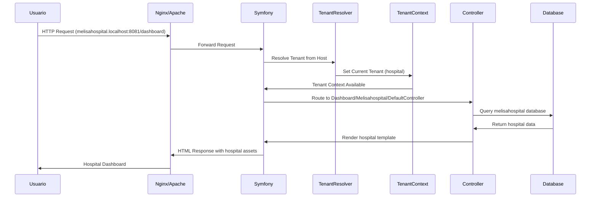
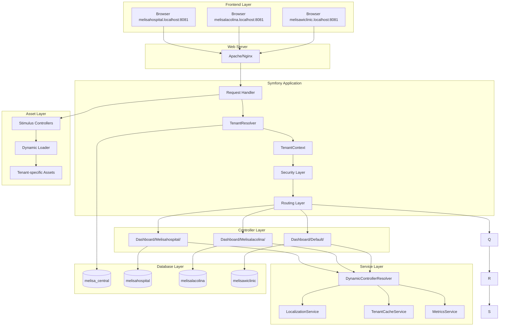

# 🏗️ Arquitectura Completa de Melisa Tenant


**Documentación técnica completa del sistema multi-tenant de gestión médica Melisa Tenant**

---

## 📋 Tabla de Contenidos

1. [Visión General del Sistema](#-visión-general-del-sistema)
2. [Arquitectura Multi-Tenant](#-arquitectura-multi-tenant)
3. [Stack Tecnológico](#️-stack-tecnológico)
4. [Componentes del Sistema](#-componentes-del-sistema)
5. [Flujo de Datos](#-flujo-de-datos)
6. [Sistema Stimulus](#-sistema-stimulus)
7. [Base de Datos](#️-base-de-datos)
8. [Servicios Core](#️-servicios-core)
9. [Seguridad y Autenticación](#-seguridad-y-autenticación)
10. [Performance y Escalabilidad](#-performance-y-escalabilidad)
11. [Patrones de Diseño](#-patrones-de-diseño)

---

## 🌟 Visión General del Sistema

### 🎯 **Propósito**
Melisa Tenant es un sistema multi-tenant de gestión médica que permite a múltiples clínicas y hospitales operar de forma independiente en una sola aplicación, manteniendo sus datos completamente separados y personalizando su experiencia según sus necesidades específicas.

### 🏢 **Modelo de Tenants**
```
🏥 melisahospital.localhost:8081  → Hospital Central (BD: melisahospital)
🌿 melisalacolina.localhost:8081  → Clínica La Colina (BD: melisalacolina)  
💻 melisawiclinic.localhost:8081  → Wi Clinic Technology (BD: melisawiclinic)
🎯 *.localhost:8081               → Tenant por defecto (BD: melisa_central)
```

### 🔄 **Principios Arquitectónicos**
- **Separación por Subdomain**: Cada tenant accede por su subdominio único
- **Aislamiento de Datos**: Bases de datos completamente independientes
- **Personalización**: UI/UX específica por tipo de organización médica
- **Extensibilidad**: Fácil agregar nuevos tenants sin afectar existentes
- **Performance**: Carga dinámica de recursos específicos por tenant

---

## 🏗️ Arquitectura Multi-Tenant

### 🌐 **Detección y Resolución de Tenants**

#### **1. Flujo de Resolución**


#### **2. TenantResolver.php - Core del Sistema**
```php
<?php
namespace App\Service;

class TenantResolver
{
    private array $tenantConfig = [
        'melisahospital' => [
            'database' => 'melisahospital',
            'name' => 'Hospital Central',
            'type' => 'hospital',
            'theme' => 'medical-blue'
        ],
        'melisalacolina' => [
            'database' => 'melisalacolina', 
            'name' => 'Clínica La Colina',
            'type' => 'clinic',
            'theme' => 'nature-green'
        ],
        'melisawiclinic' => [
            'database' => 'melisawiclinic',
            'name' => 'Wi Clinic Technology', 
            'type' => 'tech-clinic',
            'theme' => 'tech-purple'
        ]
    ];

    public function resolveTenantFromRequest(Request $request): ?Tenant
    {
        $host = $request->getHost();
        $subdomain = $this->extractSubdomain($host);
        
        return $this->tenantConfig[$subdomain] ?? $this->getDefaultTenant();
    }
}
```

### 🎛️ **Sistema de Controllers Dinámicos**

#### **1. Estructura Jerárquica**
```
src/Controller/
├── AbstractTenantController.php      # 🏗️ Base para todos los controllers
├── DefaultController.php             # 🏠 Controller principal/home
├── LoginController.php               # 🔐 Autenticación multi-tenant
├── PasswordResetController.php       # 🔄 Reset de contraseñas
├── TenantController.php             # 🏢 Gestión de tenants
└── Dashboard/                        # 📊 Controllers especializados
    ├── Default/                      # 🎯 Dashboard base (fallback)
    │   ├── DefaultController.php     # Funcionalidad estándar
    │   ├── PatientController.php     # Gestión pacientes básica
    │   └── ReportController.php      # Reportes generales
    ├── Melisahospital/              # 🏥 Controllers específicos hospital
    │   ├── DefaultController.php     # Dashboard hospitalario
    │   ├── EmergencyController.php   # Centro de emergencias
    │   ├── SurgeryController.php     # Gestión quirófanos
    │   └── ICUController.php         # Unidad cuidados intensivos
    └── Melisalacolina/              # 🌿 Controllers específicos clínica
        ├── DefaultController.php     # Dashboard clínica
        ├── AppointmentController.php # Gestión de citas
        ├── SpecialtyController.php   # Especialidades médicas
        └── InsuranceController.php   # Gestión de seguros
```

#### **2. DynamicControllerResolver.php**
```php
<?php
namespace App\Service;

class DynamicControllerResolver
{
    public function resolveController(string $tenantKey, string $controllerName): string
    {
        // 1. Buscar controller específico del tenant
        $tenantController = "App\\Controller\\Dashboard\\{$tenantKey}\\{$controllerName}";
        if (class_exists($tenantController)) {
            return $tenantController;
        }
        
        // 2. Fallback a controller por defecto
        $defaultController = "App\\Controller\\Dashboard\\Default\\{$controllerName}";
        if (class_exists($defaultController)) {
            return $defaultController;
        }
        
        throw new ControllerNotFoundException();
    }
}
```

---

## 🛠️ Stack Tecnológico

### 🎯 **Backend Core**
| Tecnología | Versión | Propósito |
|------------|---------|-----------|
| **PHP** | 8.1+ | Runtime principal |
| **Symfony** | 6.4 | Framework web MVC |
| **Doctrine ORM** | 2.x | Mapeo objeto-relacional |
| **MySQL** | 8.0+ | Base de datos principal |
| **Twig** | 3.x | Motor de templates |

### ⚡ **Frontend Stack**
| Tecnología | Versión | Propósito |
|------------|---------|-----------|
| **Stimulus** | 3.2 | JavaScript framework |
| **Bootstrap** | 5.3 | CSS framework |
| **AssetMapper** | Symfony 6.4 | Gestión de assets |
| **Font Awesome** | 6.x | Iconografía |
| **CSS3** | - | Estilos personalizados |

### 🔧 **Herramientas y Utilidades**
| Herramienta | Propósito |
|-------------|-----------|
| **Composer** | Gestión dependencias PHP |
| **PHPUnit** | Testing automatizado |
| **Symfony Console** | Comandos CLI |
| **Doctrine Migrations** | Gestión esquemas BD |
| **Monolog** | Sistema de logging |

---

## 🧩 Componentes del Sistema

### 1. 🏗️ **Entities y Modelo de Datos**

#### **Entity: Tenant.php**
```php
<?php
namespace App\Entity;

#[ORM\Entity(repositoryClass: TenantRepository::class)]
class Tenant
{
    #[ORM\Id]
    #[ORM\GeneratedValue]
    #[ORM\Column]
    private ?int $id = null;

    #[ORM\Column(length: 100, unique: true)]
    private string $subdomain;

    #[ORM\Column(length: 255)]
    private string $name;

    #[ORM\Column(length: 100)]
    private string $databaseName;

    #[ORM\Column(length: 50)]
    private string $type; // 'hospital', 'clinic', 'tech-clinic'

    #[ORM\Column(type: 'json')]
    private array $config = [];

    #[ORM\OneToMany(mappedBy: 'tenant', targetEntity: TenantMember::class)]
    private Collection $members;
}
```

#### **Entity: Member.php**
```php
<?php
namespace App\Entity;

#[ORM\Entity(repositoryClass: MemberRepository::class)]
class Member implements UserInterface
{
    #[ORM\Id]
    #[ORM\GeneratedValue]
    #[ORM\Column]
    private ?int $id = null;

    #[ORM\Column(length: 180, unique: true)]
    private string $email;

    #[ORM\Column(type: 'json')]
    private array $roles = [];

    #[ORM\Column]
    private string $password;

    #[ORM\OneToMany(mappedBy: 'member', targetEntity: TenantMember::class)]
    private Collection $tenantMemberships;
}
```
### 2. 🎮 **Sistema Stimulus con Fallback**

#### **Estructura de Controllers Stimulus**
```
assets/controllers/
├── dynamic_loader.js               # 🔄 Cargador dinámico con fallback
├── internal/                       # 📝 Controllers internos (UI/Forms)
│   ├── default/                    # 🎯 Controllers base
│   │   ├── patient_controller.js   # Gestión pacientes estándar
│   │   ├── form_controller.js      # Formularios básicos
│   │   └── modal_controller.js     # Modales generales
│   ├── melisahospital/            # 🏥 Controllers hospital
│   │   ├── patient_controller.js   # Pacientes hospitalarios
│   │   ├── emergency_controller.js # Centro emergencias
│   │   └── surgery_controller.js   # Gestión quirófanos
│   └── melisalacolina/            # 🌿 Controllers clínica
│       ├── patient_controller.js   # Pacientes ambulatorios
│       ├── appointment_controller.js # Sistema citas
│       └── insurance_controller.js # Gestión seguros
```

#### **dynamic_loader.js - Sistema de Fallback**
```javascript
// assets/controllers/dynamic_loader.js
class DynamicControllerLoader {
    constructor() {
        this.subdomain = this.detectSubdomain();
        this.debugMode = true;
    }

    detectSubdomain() {
        const hostname = window.location.hostname;
        const parts = hostname.split('.');
        return parts[0] || 'default';
    }

    async loadController(type, name) {
        const tenantPath = `${type}/${this.subdomain}/${name}`;
        const defaultPath = `${type}/default/${name}`;
        
        try {
            // 1. Intentar cargar controller específico del tenant
            const tenantController = await import(`./${tenantPath}.js`);
            this.log(`✅ Controller cargado: ${tenantPath}`);
            return tenantController.default;
        } catch (tenantError) {
            this.log(`⚠️  Controller específico no encontrado: ${tenantPath}`);
            
            try {
                // 2. Fallback a controller por defecto
                const defaultController = await import(`./${defaultPath}.js`);
                this.log(`✅ Fallback cargado: ${defaultPath}`);
                return defaultController.default;
            } catch (defaultError) {
                this.log(`❌ Controller no encontrado: ${name}`, 'error');
                throw new Error(`Controller no disponible: ${name}`);
            }
        }
    }

    log(message, level = 'info') {
        if (this.debugMode) {
            console.log(`🎮 [Dynamic Loader] ${message}`);
        }
    }
}

export default new DynamicControllerLoader();
```

---

## 🔄 Flujo de Datos

### 🌊 **Request Lifecycle**



### 📊 **API Request Flow**
### 🏗️ **Arquitectura de Datos Multi-Tenant**

#### **Esquema de Bases de Datos**
```
🗄️ melisa_central (BD Principal)
├── tenants                    # Configuración de tenants
├── members                    # Usuarios del sistema  
├── tenant_members            # Relación user-tenant
└── migrations               # Control de versiones

🏥 melisahospital (BD Hospital)
├── patients                 # Pacientes hospitalarios
├── emergency_records       # Registros emergencias
├── surgery_schedules      # Programación quirófanos
├── icu_monitoring         # Monitoreo UCI
└── medical_equipment      # Equipamiento médico

🌿 melisalacolina (BD Clínica)  
├── patients               # Pacientes ambulatorios
├── appointments          # Sistema de citas
├── specialties           # Especialidades médicas
├── insurance_plans       # Planes de seguros
└── treatment_history     # Historial tratamientos

💻 melisawiclinic (BD Tecnológica)
├── patients              # Pacientes con IoT
├── telemetry_data       # Datos telemetría
├── ai_diagnostics       # Diagnósticos IA
├── blockchain_records   # Registros blockchain
└── iot_devices          # Dispositivos IoT
```

#### **Migrations Multi-Tenant**
```php
<?php
// migrations/Version20241015000001.php
class Version20241015000001 extends AbstractMigration
{
    public function up(Schema $schema): void
    {
        // Migración para BD central
        $this->addSql('CREATE TABLE tenants (
            id INT AUTO_INCREMENT NOT NULL,
            subdomain VARCHAR(100) NOT NULL UNIQUE,
            name VARCHAR(255) NOT NULL,
            database_name VARCHAR(100) NOT NULL,
            type VARCHAR(50) NOT NULL,
            config JSON NOT NULL,
            created_at DATETIME NOT NULL,
            updated_at DATETIME NOT NULL,
            PRIMARY KEY(id)
        )');
    }

    public function down(Schema $schema): void
    {
        $this->addSql('DROP TABLE tenants');
    }
}
```

---

## ⚙️ Servicios Core

### 🔍 **TenantContext.php - Contexto Global**
```php
<?php
namespace App\Service;

class TenantContext
{
    private ?Tenant $currentTenant = null;
    private ?EntityManagerInterface $tenantEntityManager = null;

    public function __construct(
        private ManagerRegistry $doctrine,
        private ConnectionFactory $connectionFactory
    ) {}

    public function setCurrentTenant(?Tenant $tenant): void
    {
        $this->currentTenant = $tenant;
        $this->tenantEntityManager = null; // Reset EM para nueva conexión
    }

    public function getCurrentTenant(): ?Tenant
    {
        return $this->currentTenant;
    }

    public function getTenantEntityManager(): EntityManagerInterface
    {
        if ($this->tenantEntityManager === null) {
            if ($this->currentTenant === null) {
                throw new \RuntimeException('No se ha establecido un tenant activo');
            }

            $connection = $this->connectionFactory->createConnection([
                'host' => $_ENV['DATABASE_HOST'],
                'dbname' => $this->currentTenant->getDatabaseName(),
                'user' => $_ENV['DATABASE_USER'],
                'password' => $_ENV['DATABASE_PASSWORD'],
                'driver' => 'pdo_mysql'
            ]);

            $config = Setup::createAttributeMetadataConfiguration(
                [__DIR__ . '/../Entity'],
                true
            );

            $this->tenantEntityManager = new EntityManager($connection, $config);
        }

        return $this->tenantEntityManager;
    }

    public function isTenant(string $tenantKey): bool
    {
        return $this->currentTenant && 
               $this->currentTenant->getSubdomain() === $tenantKey;
    }
}
```

### 🌍 **LocalizationService.php - Localización**
```php
<?php
namespace App\Service;

class LocalizationService
{
    private array $tenantLanguages = [
        'melisahospital' => 'es_ES',
        'melisalacolina' => 'es_CO', 
        'melisawiclinic' => 'en_US'
    ];

    public function __construct(
        private TenantContext $tenantContext,
        private TranslatorInterface $translator
    ) {}

    public function getTenantLocale(): string
    {
        $tenant = $this->tenantContext->getCurrentTenant();
        
        if ($tenant) {
            return $this->tenantLanguages[$tenant->getSubdomain()] ?? 'es_ES';
        }
        
        return 'es_ES';
    }

    public function translateForTenant(string $key, array $parameters = []): string
    {
        $locale = $this->getTenantLocale();
        return $this->translator->trans($key, $parameters, null, $locale);
    }
}
```

---

## 🔐 Seguridad y Autenticación

### 🛡️ **Sistema de Autenticación Multi-Tenant**

#### **Security Configuration**
```yaml
# config/packages/security.yaml
security:
    providers:
        tenant_user_provider:
            entity:
                class: App\Entity\Member
                property: email

    firewalls:
        main:
            lazy: true
            provider: tenant_user_provider
            form_login:
                login_path: app_login
                check_path: app_login
                default_target_path: app_dashboard
                username_parameter: email
                password_parameter: password
            logout:
                path: app_logout
                target: app_login
            custom_authenticators:
                - App\Security\TenantAuthenticator

    access_control:
        - { path: ^/login, roles: PUBLIC_ACCESS }
        - { path: ^/api/docs, roles: PUBLIC_ACCESS }
        - { path: ^/api, roles: ROLE_API_USER }
        - { path: ^/dashboard, roles: ROLE_USER }
        - { path: ^/admin, roles: ROLE_ADMIN }
```

#### **TenantAuthenticator.php**
```php
<?php
namespace App\Security;

class TenantAuthenticator extends AbstractFormLoginAuthenticator
{
    public function __construct(
        private TenantResolver $tenantResolver,
        private TenantContext $tenantContext,
        private UserPasswordHasherInterface $passwordHasher,
        private RouterInterface $router
    ) {}

    public function authenticate(Request $request): Passport
    {
        $email = $request->request->get('email', '');
        $password = $request->request->get('password', '');

        // Resolver tenant desde el request
        $tenant = $this->tenantResolver->resolveTenantFromRequest($request);
        $this->tenantContext->setCurrentTenant($tenant);

        return new Passport(
            new UserBadge($email, [$this, 'loadUser']),
            new PasswordCredentials($password),
            [
                new CsrfTokenBadge('authenticate', $request->request->get('_csrf_token')),
                new TenantBadge($tenant) // Badge personalizado para validar tenant
            ]
        );
    }

    public function loadUser(string $userIdentifier): UserInterface
    {
        // Cargar usuario verificando pertenencia al tenant actual
        $tenant = $this->tenantContext->getCurrentTenant();
        
        $repository = $this->tenantContext->getTenantEntityManager()
                           ->getRepository(Member::class);
        
        $user = $repository->findOneBy(['email' => $userIdentifier]);
        
        if (!$user || !$this->userBelongsToTenant($user, $tenant)) {
            throw new UserNotFoundException('Usuario no encontrado en este tenant');
        }
        
        return $user;
    }
}
```

---

## 🚀 Performance y Escalabilidad

### ⚡ **Optimizaciones Implementadas**

#### **1. Caching Multi-Tenant**
```php
<?php
namespace App\Service;

class TenantCacheService
{
    public function __construct(
        private CacheInterface $cache,
        private TenantContext $tenantContext
    ) {}

    public function getTenantCacheKey(string $key): string
    {
        $tenant = $this->tenantContext->getCurrentTenant();
        $tenantKey = $tenant ? $tenant->getSubdomain() : 'default';
        return "tenant_{$tenantKey}_{$key}";
    }

    public function cacheForTenant(string $key, mixed $data, int $ttl = 3600): void
    {
        $cacheKey = $this->getTenantCacheKey($key);
        $this->cache->set($cacheKey, $data, $ttl);
    }

    public function getFromTenantCache(string $key): mixed
    {
        $cacheKey = $this->getTenantCacheKey($key);
        return $this->cache->get($cacheKey);
    }
}
```

#### **2. Asset Loading Optimization**
```javascript
// assets/app.js - Optimización de carga
class AssetOptimizer {
    constructor() {
        this.subdomain = this.detectSubdomain();
        this.loadedAssets = new Set();
    }

    async loadTenantAssets() {
        const tenantCSS = `styles/${this.subdomain}.css`;
        const tenantJS = `scripts/${this.subdomain}.js`;

        // Carga asíncrona de assets específicos del tenant
        await Promise.all([
            this.loadCSS(tenantCSS),
            this.loadJS(tenantJS)
        ]);
    }

    async loadCSS(url) {
        if (this.loadedAssets.has(url)) return;

        return new Promise((resolve, reject) => {
            const link = document.createElement('link');
            link.rel = 'stylesheet';
            link.href = url;
            link.onload = () => {
                this.loadedAssets.add(url);
                resolve();
            };
            link.onerror = reject;
            document.head.appendChild(link);
        });
    }
}
```

### 📊 **Monitoring y Métricas**

#### **Métricas por Tenant**
```php
<?php
namespace App\Service;

class TenantMetricsService
{
    public function __construct(
        private MetricsCollectorInterface $metrics,
        private TenantContext $tenantContext
    ) {}

    public function recordApiCall(string $endpoint, float $duration): void
    {
        $tenant = $this->tenantContext->getCurrentTenant();
        $tenantKey = $tenant ? $tenant->getSubdomain() : 'default';
        
        $this->metrics->increment('api.calls.total', [
            'tenant' => $tenantKey,
            'endpoint' => $endpoint
        ]);
        
        $this->metrics->histogram('api.duration', $duration, [
            'tenant' => $tenantKey,
            'endpoint' => $endpoint
        ]);
    }

    public function recordDatabaseQuery(string $query, float $duration): void
    {
        $tenant = $this->tenantContext->getCurrentTenant();
        $tenantKey = $tenant ? $tenant->getSubdomain() : 'default';
        
        $this->metrics->histogram('database.query.duration', $duration, [
            'tenant' => $tenantKey,
            'type' => $this->classifyQuery($query)
        ]);
    }
}
```

---

## 🎯 Patrones de Diseño

### 🏭 **Factory Pattern - Tenant Factory**
```php
<?php
namespace App\Factory;

class TenantFactory
{
    public function createTenant(array $config): Tenant
    {
        $tenant = new Tenant();
        $tenant->setSubdomain($config['subdomain']);
        $tenant->setName($config['name']);
        $tenant->setDatabaseName($config['database']);
        $tenant->setType($config['type']);
        $tenant->setConfig($config['settings'] ?? []);
        
        return $tenant;
    }

    public function createHospitalTenant(string $subdomain, string $name): Tenant
    {
        return $this->createTenant([
            'subdomain' => $subdomain,
            'name' => $name,
            'database' => $subdomain,
            'type' => 'hospital',
            'settings' => [
                'features' => ['emergency', 'surgery', 'icu'],
                'theme' => 'medical-blue',
                'modules' => ['patients', 'surgery', 'emergency', 'pharmacy']
            ]
        ]);
    }

    public function createClinicTenant(string $subdomain, string $name): Tenant
    {
        return $this->createTenant([
            'subdomain' => $subdomain,
            'name' => $name,
            'database' => $subdomain,
            'type' => 'clinic',
            'settings' => [
                'features' => ['appointments', 'specialties', 'insurance'],
                'theme' => 'nature-green',
                'modules' => ['patients', 'appointments', 'insurance']
            ]
        ]);
    }
}
```

### 🎭 **Strategy Pattern - Tenant Strategies**
```php
<?php
namespace App\Strategy;

interface TenantStrategyInterface
{
    public function getDefaultDashboard(): string;
    public function getAvailableModules(): array;
    public function getThemeConfig(): array;
    public function getApiFeatures(): array;
}

class HospitalStrategy implements TenantStrategyInterface
{
    public function getDefaultDashboard(): string
    {
        return 'dashboard/melisahospital/default.html.twig';
    }

    public function getAvailableModules(): array
    {
        return [
            'emergency' => 'Centro de Emergencias',
            'surgery' => 'Gestión de Quirófanos', 
            'icu' => 'Unidad de Cuidados Intensivos',
            'pharmacy' => 'Farmacia Hospitalaria',
            'laboratory' => 'Laboratorio 24h'
        ];
    }

    public function getThemeConfig(): array
    {
        return [
            'primary_color' => '#1e40af',
            'secondary_color' => '#3b82f6',
            'accent_color' => '#ef4444',
            'layout' => 'hospital-layout'
        ];
    }

    public function getApiFeatures(): array
    {
        return [
            'real_time_monitoring',
            'emergency_protocols',
            'surgery_scheduling',
            'equipment_tracking'
        ];
    }
}
```

### 🔍 **Observer Pattern - Tenant Events**
```php
<?php
namespace App\EventListener;

class TenantEventListener
{
    public function __construct(
        private TenantCacheService $cacheService,
        private LoggerInterface $logger,
        private MetricsService $metrics
    ) {}

    #[AsEventListener(event: TenantSwitchedEvent::class)]
    public function onTenantSwitched(TenantSwitchedEvent $event): void
    {
        $tenant = $event->getTenant();
        
        // Limpiar cache del tenant anterior
        $this->cacheService->clearTenantCache($event->getPreviousTenant());
        
        // Pre-cargar datos críticos del nuevo tenant
        $this->cacheService->preloadTenantData($tenant);
        
        // Log del cambio de tenant
        $this->logger->info('Tenant switched', [
            'from' => $event->getPreviousTenant()?->getSubdomain(),
            'to' => $tenant->getSubdomain(),
            'user' => $event->getUser()?->getEmail()
        ]);
        
        // Métricas de uso
        $this->metrics->recordTenantSwitch($tenant);
    }
}
```

---

## 📈 Diagrama de Arquitectura Completa



---

## 🎓 Conclusiones y Beneficios

### ✅ **Ventajas de la Arquitectura**

1. **🔒 Aislamiento Completo**
   - Datos separados por tenant
   - Fallas aisladas por organización
   - Seguridad y privacidad garantizada

2. **⚡ Performance Optimizada**
   - Carga bajo demanda de recursos
   - Cache específico por tenant
   - Assets mínimos por página

3. **🎨 Personalización Total**
   - UI/UX específica por organización
   - Funcionalidades por tipo de centro médico
   - Branding y temas personalizados

4. **📈 Escalabilidad**
   - Fácil agregar nuevos tenants
   - Independencia entre organizaciones
   - Recursos distribuidos eficientemente

5. **🛠️ Mantenibilidad**
   - Código base unificado
   - Actualizaciones centralizadas
   - Testing por tenant

### 🚀 **Casos de Uso Perfectos**

- **Hospitales Grandes**: Centro de emergencias, quirófanos, UCI
- **Clínicas Especializadas**: Consultas, especialidades, seguros
- **Centros Tecnológicos**: IoT médico, IA, telemetría
- **Redes de Salud**: Múltiples centros, datos centralizados

### 🔮 **Futuras Mejoras**

1. **Microservicios**: Dividir en servicios independientes
2. **API Gateway**: Centralizar gestión de APIs
3. **Event Sourcing**: Auditoría completa de cambios
4. **Real-time**: WebSockets para actualizaciones en vivo
5. **IA/ML**: Análisis predictivo por tenant

---

**📝 Documento creado por el equipo de desarrollo de RayenSalud**
**🗓️ Fecha: Octubre 2025**
**📞 Contacto: desarrollo@rayensalud.com**

---

# 🔄 APÉNDICE: Dynamic Controller Resolution System

_Detalle técnico del sistema de resolución dinámica de controladores_

# Dynamic Controller Resolution System

## 📋 Resumen

El sistema de resolución dinámica de controladores permite que la aplicación multi-tenant resuelva automáticamente controladores específicos por tenant sin configuración manual. Utiliza un patrón de EventSubscriber + Service para interceptar requests y redirigir a controladores personalizados.

## 🏗️ Arquitectura

### Componentes principales:

1. **`DynamicControllerSubscriber`** - EventSubscriber que intercepta requests
2. **`DynamicControllerResolver`** - Service que contiene la lógica de resolución
3. **`TenantContext`** - Proporciona información del tenant actual

## 🔄 Flujo de ejecución completo

### 1. Request inicial
```
Usuario visita: https://melisahospital.com/dashboard
```

### 2. Symfony resuelve ruta básica
```php
// routes.yaml o anotaciones
#[Route('/dashboard', name: 'app_dashboard')]
// Controlador inicial: App\Controller\Dashboard\Default\DefaultController::index
```

### 3. DynamicControllerSubscriber intercepta
```php
// src/EventSubscriber/DynamicControllerSubscriber.php
public function onKernelRequest(RequestEvent $event): void
{
    $originalController = $request->attributes->get('_controller');
    // "App\Controller\Dashboard\Default\DefaultController::index"
    
    $tenant = $this->tenantContext->getCurrentTenant();
    $tenantSubdomain = $tenant['subdomain']; // "melisahospital"
    
    // Verificar si debe resolverse dinámicamente
    if ($this->shouldResolveDynamically($originalController, $tenantSubdomain)) {
        // Llamar al resolver
        $resolvedController = $this->controllerResolver->resolveControllerFromRoute(
            $originalController,
            $tenantSubdomain
        );
        
        // Actualizar el controlador en el request
        $request->attributes->set('_controller', $resolvedController);
    }
}
```

### 4. DynamicControllerResolver resuelve
```php
// src/Service/DynamicControllerResolver.php
public function resolveControllerFromRoute(string $originalController, string $tenantSubdomain): string
{
    // Analiza el controlador original
    [$originalClass, $method] = explode('::', $originalController);
    $classParts = explode('\\', $originalClass);
    
    // Extrae componentes
    $baseNamespace = "App\\Controller";
    $controllerType = "Dashboard"; 
    $controllerName = "DefaultController";
    $tenantKey = "Melisahospital";
    
    // Genera patrones de búsqueda por prioridad
    $dynamicPatterns = [
        "App\\Controller\\Dashboard\\Melisahospital\\DefaultController", // ✅ Este existe
        "App\\Controller\\Melisahospital\\DefaultController",
        "App\\Controller\\Dashboard\\Default\\DefaultController", 
        $originalClass // Controlador original como fallback
    ];
    
    // Encuentra el primero que exista
    foreach ($dynamicPatterns as $pattern) {
        if (class_exists($pattern) && method_exists($pattern, $method)) {
            return $pattern . '::' . $method;
        }
    }
}
```

### 5. Symfony ejecuta controlador resuelto
```php
// src/Controller/Dashboard/Melisahospital/DefaultController.php
class DefaultController extends AbstractDashboardController
{
    public function index(Request $request): Response
    {
        // Lógica específica del hospital
        return $this->renderDashboard('melisahospital', [...]);
    }
}
```

## 🎯 Lógica de filtrado

### ❌ **NO se resuelven dinámicamente:**
```php
private function shouldResolveDynamically(string $controller, string $tenantSubdomain): bool
{
    // Controladores ya específicos del tenant
    if (str_contains($controller, ucfirst($tenantSubdomain))) {
        return false;
    }
    
    // Controladores de sistema
    $systemControllers = [
        'App\\Controller\\LoginController',
        'App\\Controller\\SecurityController', 
        'App\\Controller\\LocaleController',
        'Symfony\\',
    ];
    
    // Controladores centrales (mantenedores)
    $centralControllers = [
        'App\\Controller\\Mantenedores\\Basico\\',
        'App\\Controller\\Mantenedores\\',
    ];
}
```

### ✅ **SÍ se resuelven dinámicamente:**
- Cualquier controlador bajo `App\Controller\` que NO esté en las exclusiones
- Esto hace al sistema escalable: nuevos controladores automáticamente funcionan

## 🔍 Patrones de resolución

### DynamicControllerResolver tiene 3 métodos principales:

#### 1. `resolve()` - Resolución basada en patrones de configuración
```php
public function resolve(Request $request): callable
```
- Usa parámetros como `_controller_pattern`, `_fallback_controller`
- Para rutas con configuración explícita

#### 2. `resolveController()` - Resolución por parámetros
```php
public function resolveController(string $subdomain, string $controller, string $action = 'index'): string
```
- Múltiples patrones de búsqueda jerárquicos
- Para llamadas programáticas

#### 3. `resolveControllerFromRoute()` - Resolución automática (usado por Subscriber)
```php
public function resolveControllerFromRoute(string $originalController, string $tenantSubdomain): string
```
- Analiza automáticamente el controlador original
- Genera patrones dinámicos sin configuración

## 📁 Estructura de controladores soportada

```
src/Controller/
├── Dashboard/
│   ├── Default/
│   │   └── DefaultController.php          # Fallback general
│   ├── Melisahospital/
│   │   └── DefaultController.php          # Hospital específico ✅
│   └── Melisalacolina/
│       └── DefaultController.php          # Clínica específica ✅
├── Mantenedores/
│   └── Basico/
│       ├── PaisController.php             # Central - NO se resuelve ❌
│       └── RegionController.php           # Central - NO se resuelve ❌
├── Reportes/
│   ├── Default/
│   │   └── DefaultController.php          # Fallback
│   └── Melisahospital/
│       └── DefaultController.php          # Hospital específico ✅
└── LoginController.php                    # Sistema - NO se resuelve ❌
```

## 🚀 Ventajas del sistema

### 1. **Automático y escalable**
- Nuevos controladores automáticamente funcionan con multi-tenant
- Zero configuración manual por ruta
- Solo necesitas crear la estructura de carpetas

### 2. **Flexible y robusto**
- Múltiples patrones de fallback
- Logging detallado para debugging
- Manejo de errores graceful

### 3. **Separación de responsabilidades**
- Subscriber: Decide QUÉ resolver
- Resolver: Decide CÓMO resolver
- Cada clase tiene una responsabilidad clara

### 4. **Performance optimizado**
- Solo se ejecuta cuando es necesario
- Caché de resolución implícito (class_exists)
- Patrones ordenados por probabilidad

## 🔧 Configuración

### Registrar el EventSubscriber
```yaml
# config/services.yaml
App\EventSubscriber\DynamicControllerSubscriber:
    tags:
        - { name: kernel.event_subscriber }
```

### Prioridad de ejecución
```php
public static function getSubscribedEvents(): array
{
    return [
        // Ejecutar después del LocaleListener pero antes del controlador
        KernelEvents::REQUEST => [['onKernelRequest', 15]],
    ];
}
```

## 🐛 Debugging

### Ver logs de resolución
```bash
tail -f var/log/dev.log | grep "Controlador resuelto dinámicamente"
```

### Método de debug disponible
```php
$debugInfo = $this->controllerResolver->getDebugInfo('melisahospital');
// Retorna información sobre controladores disponibles, paths, etc.
```

## 📝 Ejemplo práctico

### Crear nuevo controlador específico por tenant:

1. **Crear estructura**:
```bash
mkdir -p src/Controller/Facturas/Melisahospital
```

2. **Crear controlador**:
```php
// src/Controller/Facturas/Melisahospital/DefaultController.php
namespace App\Controller\Facturas\Melisahospital;

class DefaultController 
{
    #[Route('/facturas', name: 'app_facturas')]
    public function index(): Response
    {
        // Lógica específica de facturación para hospital
    }
}
```

3. **¡Listo!** - El sistema automáticamente:
   - Detecta que `App\Controller\Facturas\` debe resolverse
   - Encuentra el controlador específico para melisahospital
   - Redirige automáticamente sin configuración adicional

## ⚠️ Consideraciones importantes

### Templates NO se resuelven dinámicamente
- El DynamicControllerResolver solo maneja controladores
- Cada controlador debe resolver sus propios templates según su lógica
- Esto proporciona mayor flexibilidad y control

### Mantenedores son centrales
- Los controladores bajo `App\Controller\Mantenedores\` NO se resuelven
- Son compartidos entre todos los tenants
- Para funcionalidad específica por tenant, usar otras estructuras

### Orden de prioridad importa
- Los patrones se evalúan en orden de prioridad
- El primer controlador encontrado se usa
- Estructura jerárquica permite overrides específicos